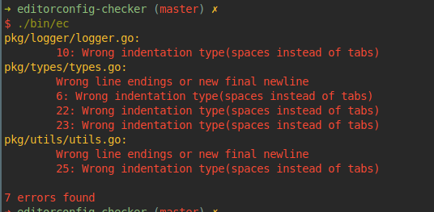

# editorconfig-checker

<a href="https://www.buymeacoffee.com/mstruebing" target="_blank"></a>

[](https://github.com/editorconfig-checker/editorconfig-checker/actions/workflows/ci.yml)
[](https://codecov.io/gh/editorconfig-checker/editorconfig-checker)
[](https://hitsofcode.com/view/github/editorconfig-checker/editorconfig-checker)
[](https://goreportcard.com/report/github.com/editorconfig-checker/editorconfig-checker/v3)


1. [What?](#what)
2. [Quickstart](#quickstart)
3. [Installation](#installation)
4. [Usage](#usage)
5. [Configuration](#configuration)
6. [Excluding](#excluding)
   1. [Excluding Lines](#excluding-lines)
   2. [Excluding Blocks](#excluding-blocks)
   3. [Excluding Files](#excluding-files)
      1. [Inline](#inline)
      2. [Default Excludes](#default-excludes)
      3. [Manually Excluding](#manually-excluding)
         1. [via configuration](#via-configuration)
         2. [via arguments](#via-arguments)
         3. [Generally](#generally)
7. [Docker](#docker)
8. [Continuous Integration](#continuous-integration)
9. [Support](#support)

## What?



This is a tool to check if your files consider your `.editorconfig` rules.
Most tools—like linters, for example—only test one filetype and need an extra configuration.
This tool only needs your `.editorconfig` to check all files.

If you don't know about editorconfig already you can read about it here: [editorconfig.org](https://editorconfig.org/).

Currently, implemented editorconfig features are:

- `end_of_line`
- `insert_final_newline`
- `trim_trailing_whitespace`
- `indent_style`
- `indent_size`
- `max_line_length`

Unsupported features are:

- `charset`

## Quickstart

```shell
VERSION="v3.0.3"
OS="linux"
ARCH="amd64"
curl -O -L -C - https://github.com/editorconfig-checker/editorconfig-checker/releases/download/$VERSION/ec-$OS-$ARCH.tar.gz && \
tar xzf ec-$OS-$ARCH.tar.gz && \
./bin/ec-$OS-$ARCH
```

## Installation

Grab a binary from the [release page](https://github.com/editorconfig-checker/editorconfig-checker/releases).

If you have go installed you can run `go get github.com/editorconfig-checker/editorconfig-checker/v3` and run `make build` inside the project folder.
This will place a binary called `ec` into the `bin` directory.

If you are using Arch Linux, you can use [pacman](https://wiki.archlinux.org/title/Pacman) to install from [extra repository](https://archlinux.org/packages/extra/x86_64/editorconfig-checker/):

```shell
pacman -S editorconfig-checker
```

Also, development (VCS) package is available in the [AUR](https://aur.archlinux.org/packages/editorconfig-checker-git):

```shell
# <favourite-aur-helper> <install-command> editorconfig-checker-git

# i.e.
paru -S editorconfig-checker-git
```

If Go 1.16 or greater is installed, you can also install it globally via `go install`:

```shell
go install github.com/editorconfig-checker/editorconfig-checker/v3/cmd/editorconfig-checker@latest
```

## Usage

```
USAGE:
  -config string
        config
  -debug
        print debugging information
  -disable-end-of-line
        disables the trailing whitespace check
  -disable-indent-size
        disables only the indent-size check
  -disable-indentation
        disables the indentation check
  -disable-insert-final-newline
        disables the final newline check
  -disable-trim-trailing-whitespace
        disables the trailing whitespace check
  -dry-run
        show which files would be checked
  -exclude string
        a regex which files should be excluded from checking - needs to be a valid regular expression
  -format
        specifies the output format, see "Formats" below for more information
  -h    print the help
  -help
        print the help
  -ignore-defaults
        ignore default excludes
  -init
        creates an initial configuration
  -no-color
        dont print colors
  -v    print debugging information
  -verbose
        print debugging information
  -version
        print the version number
```

If you run this tool from a repository root it will check all files which are added to the git repository and are text files. If the tool isn't able to determine a file type it will be added to be checked too.

If you run this tool from a normal directory it will check all files which are text files. If the tool isn't able to determine a file type it will be added to be checked too.

### Formats

The following output formats are supported:

- **default**: Plain text, human readable output.<br/>
      ```text
      <file>:
        <startingLine>-<endLine>: <message>
      ```
- **gcc**: GCC compatible output. Useful for editors that support compiling and showing syntax errors. <br/>
      `<file>:<line>:<column>: <type>: <message>`
- **github-actions**: The format used by GitHub Actions <br/>
      `::error file=<file>,line=<startingLine>,endLine=<endingLine>::<message>`
- **codeclimate**: The [Code Climate](https://github.com/codeclimate/platform/blob/master/spec/analyzers/SPEC.md#data-types) json format used for [custom quality reports](https://docs.gitlab.com/ee/ci/testing/code_quality.html#implement-a-custom-tool) in GitLab CI
  ```
  [
        {
              "check_name": "editorconfig-checker",
              "description": "Wrong indent style found (tabs instead of spaces)",
              "fingerprint": "e87a958a3960d60a11d4b49c563cccd2",
              "severity": "minor",
              "location": {
                    "path": ".vscode/extensions.json",
                    "lines": {
                    "begin": 2,
                    "end": 2
                    }
              }
        },
        ...
  ]
  ```

## Configuration

The configuration is done via arguments or an `.ecrc` file.

A sample `.ecrc` file can look like this and will be used from your current working directory if not specified via the `--config` argument:

```json
{
  "Verbose": false,
  "Debug": false,
  "IgnoreDefaults": false,
  "SpacesAftertabs": false,
  "NoColor": false,
  "Exclude": [],
  "AllowedContentTypes": [],
  "PassedFiles": [],
  "Disable": {
    "EndOfLine": false,
    "Indentation": false,
    "IndentSize": false,
    "InsertFinalNewline": false,
    "TrimTrailingWhitespace": false,
    "MaxLineLength": false
  }
}
```

You can set any of the options under the `"Disable"` section to `true` to disable those particular checks.

You could also specify command line arguments, and they will get merged with the configuration file. The command line arguments have a higher precedence than the configuration.

You can create a configuration with the `init`-flag. If you specify a `config`-path it will be created there.

By default, the allowed_content_types are:

1. `text/` (matches `text/plain`, `text/html`, etc.)
1. `application/ecmascript`
1. `application/json`
1. `application/x-ndjson`
1. `application/xml`
1. `+json` (matches `application/geo+json`, etc.)
1. `+xml` (matches `application/rss+xml`, etc.)
1. `application/octet-stream`

`application/octet-stream` is needed as a fallback when no content type could be determined. You can add additional accepted content types with the `allowed_content_types` key. But the default ones don't get removed.

## Excluding

### Excluding Lines

You can exclude single lines inline. To do that you need a comment on that line that says: `editorconfig-checker-disable-line`.

```javascript
const myTemplateString = `
  first line
     wrongly indented line because it needs to be` // editorconfig-checker-disable-line
```

Alternatively, you can use `editorconfig-checker-disable-next-line` to skip the line that comes after this comment.
This modifier is present to improve readability, or because your sometimes have no other choice because of your own/language constraints.

```javascript
// editorconfig-checker-disable-next-line used because blah blah blah what ever the reason blah
const myTemplateString = `a line that is (...) longer (...) than ... usual` // or with a very long inline comment
```

Please note that using `editorconfig-checker-disable-next-line` has only an effect on the next line, so it will report if the line where you added the modifier doesn't comply.

### Excluding Blocks

To temporarily disable all checks, add a comment containing `editorconfig-checker-disable`. Re-enable with a comment containing `editorconfig-checker-enable`

```javascript
// editorconfig-checker-disable
const myTemplateString = `
  first line
     wrongly indented line because it needs to be
`
// editorconfig-checker-enable
```

### Excluding Files

#### Inline

If you want to exclude a file inline you need a comment on the first line of the file that contains: `editorconfig-checker-disable-file`

```haskell
-- editorconfig-checker-disable-file
add :: Int -> Int -> Int
add x y =
  let result = x + y -- falsy indentation would not report
  in result -- falsy indentation would not report
```

#### Default Excludes

If you don't pass the `ignore-defaults` flag to the binary these files are excluded automatically:

```
"^\\.yarn/",
"^yarn\\.lock$",
"^package-lock\\.json$",
"^composer\\.lock$",
"^Cargo\\.lock$",
"^\\.pnp\\.cjs$",
"^\\.pnp\\.js$",
"^\\.pnp\\.loader\\.mjs$",
"\\.snap$",
"\\.otf$",
"\\.woff$",
"\\.woff2$",
"\\.eot$",
"\\.ttf$",
"\\.gif$",
"\\.png$",
"\\.jpg$",
"\\.jpeg$",
"\\.webp$",
"\\.avif",
"\\.pnm",
"\\.pbm",
"\\.pgm",
"\\.ppm",
"\\.mp4$",
"\\.wmv$",
"\\.svg$",
"\\.ico$",
"\\.bak$",
"\\.bin$",
"\\.pdf$",
"\\.zip$",
"\\.gz$",
"\\.tar$",
"\\.7z$",
"\\.bz2$",
"\\.log$",
"\\.patch$",
"\\.css\\.map$",
"\\.js\\.map$",
"min\\.css$",
"min\\.js$"
```

#### Manually Excluding

##### via configuration

In your `.ecrc` file you can exclude files with the `"exclude"` key which takes an array of regular expressions.
This will get merged with the default excludes (if not ignored). You should remember to escape your regular expressions correctly. ;)

An `.ecrc` which would ignore all test files and all Markdown files can look like this:

```json
{
  "Verbose": false,
  "IgnoreDefaults": false,
  "Exclude": ["testfiles", "\\.md$"],
  "SpacesAfterTabs": false,
  "Disable": {
    "EndOfLine": false,
    "Indentation": false,
    "IndentSize": false,
    "InsertFinalNewline": false,
    "TrimTrailingWhitespace": false,
    "MaxLineLength": false
  }
}
```

##### via arguments

If you want to play around how the tool would behave you can also pass the `--exclude` argument to the binary. This will accept a regular expression as well. If you use this argument the default excludes as well as the excludes from the `.ecrc` file will be merged together.

For example: `ec --exclude node_modules`

##### Generally

Every exclude option is merged together.

If you want to see which files the tool would check without checking them you can pass the `--dry-run` flag.

Note that while `--dry-run` outputs absolute paths, a regular expression matches on relative paths from where the `ec` command is used.

## Docker

You are able to run this tool inside a Docker container.
To do this you need to have Docker installed and run this command in your repository root which you want to check:
`docker run --rm --volume=$PWD:/check mstruebing/editorconfig-checker`

Docker Hub: [mstruebing/editorconfig-checker](https://hub.docker.com/r/mstruebing/editorconfig-checker)

## Continuous Integration

### Mega-Linter

Instead of installing and configuring `editorconfig-checker` and all other linters in your project CI workflows (GitHub Actions & others), you can use [Mega-Linter](https://megalinter.io/latest/) which does all that for you with a single [assisted installation](https://megalinter.io/latest/install-assisted/).

Mega-Linter embeds [editorconfig-checker](https://megalinter.io/latest/descriptors/editorconfig_editorconfig_checker/) by default in all its [flavors](https://megalinter.io/latest/flavors/), meaning that it will be run at each commit or Pull Request to detect any issue related to `.editorconfig`.

If you want to use only `editorconfig-checker` and not the 70+ other linters, you can use the following `.mega-linter.yml` configuration file:

```yaml
ENABLE:
  - EDITORCONFIG
```

### GitLab CI

The [ss-open/ci/recipes project](https://gitlab.com/ss-open/ci/recipes) offers a ready to use lint job integrating editorconfig-checker.

- Main documentation: https://gitlab.com/ss-open/ci/recipes/-/blob/main/README.md
- Editorconfig job specific documentation: https://gitlab.com/ss-open/ci/recipes/-/blob/main/stages/lint/editorconfig/README.md

## Support

If you have any questions, suggestions, need a wrapper for a programming language or just want to chat join #editorconfig-checker on freenode(IRC).
If you don't have an IRC-client set up you can use the [freenode webchat](https://webchat.freenode.net/?channels=editorconfig-checker).
